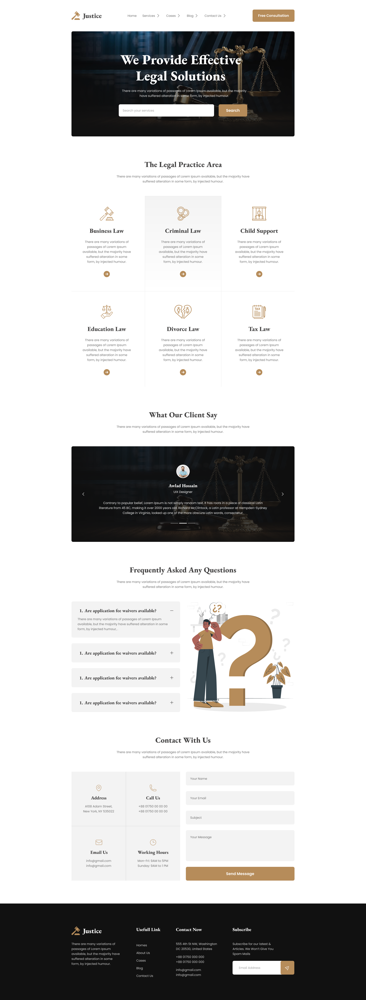

# Justice Legal Solutions

The Bootstrap CSS framework was used in this project to construct a responsive Justice Legal Solutions Landing Page. I learned how to create a responsive website without using Vanilla CSS here.

liveDemo: https://imamahasane.github.io/JusticeLegalSolutions/

sourceCode: https://github.com/imamahasane/JusticeLegalSolutions

